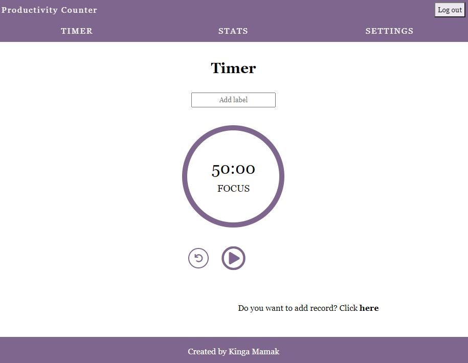
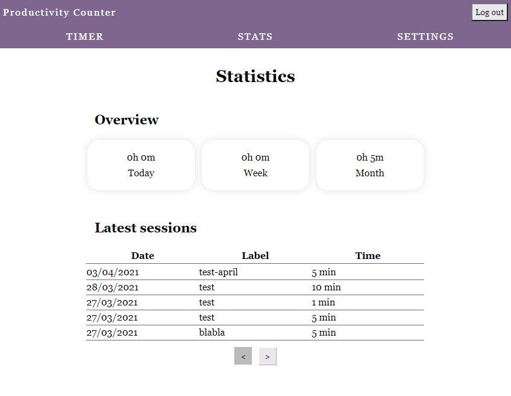
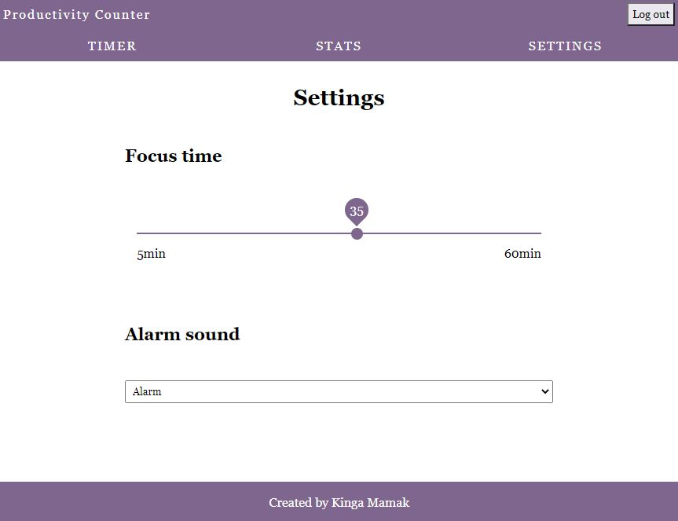

# Productivity Counter

Productivity Counter was designed to track your daily productivity. With simple countdown timer you can measure minutes spent on certain activities and keep your time under control.

## Table of contents

1. [Technologies](#technologies)
2. [Demo](#demo)
3. [Setup](#setup)
4. [Features](#features)
5. [Inspiration](#inspiration)

## Technologies

- CSS
- Java Script ES6
- React (version 17.0.1)
- Axios (version 6.14.8)
- Firebase (version 8.2.10)
- Jest (version 5.11.9)

## Demo

Live version of app ia available here: https://kingam280.github.io/productivity-counter/

## Setup

Clone this repo to your desktop. Run `npm install` to install all the dependencies. Use `npm start` to open the project.

Use `npm run test` to run tests.

## Features

- signing up ang logging in implemented with Firebase Authentiaction
- timer section with countdown timer and possibility to add label
- saving sessions to Firebase Realtime Database
- stats section for logged users which shows latest sessions
- settings with possibility to set focus time and alarm sound

To do:

- save sessions to local storage for nost logged users
- charts in stats section
- tests

## Inspiration

Project was inspired by https://pomodor.app/timer.
